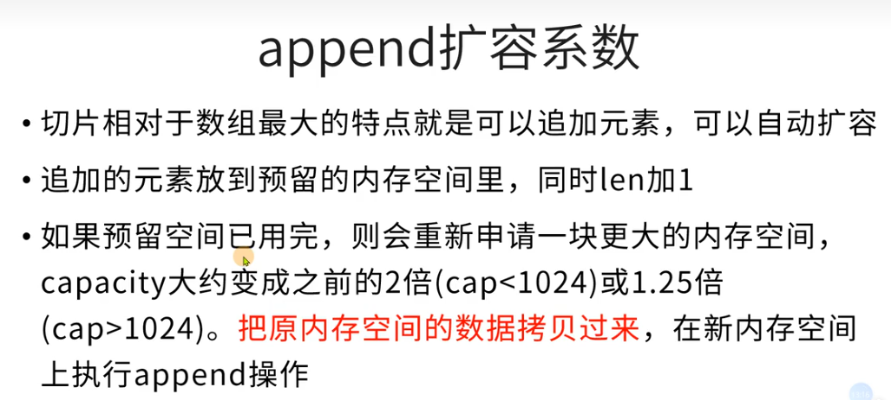
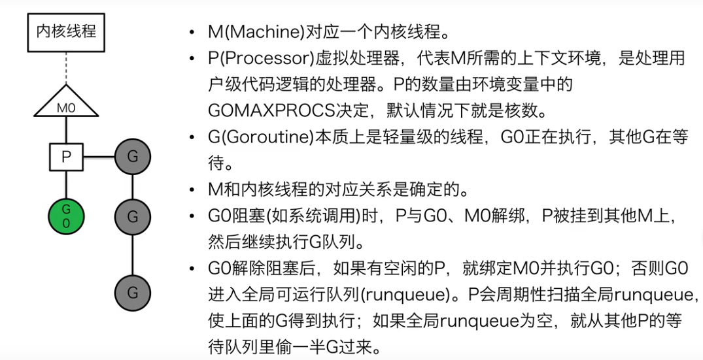

# **【马哥教育Golang专题课】**

[华科大大佬50个小时讲完的Golang，Go语言全套](https://www.bilibili.com/video/BV1CU4y1d7Vc?spm_id_from=333.337.search-card.all.click)

[马哥教育2021-Go语言开发实战-Prometheus定制化二次开发【高薪必备】](https://www.bilibili.com/video/BV1Tr4y1P7SB?spm_id_from=333.999.0.0)

[马哥教育2021-Go语言开发框架beego入门到精通必备](https://www.bilibili.com/video/BV1Ti4y1K7Tt?spm_id_from=333.999.0.0)

[马哥教育2021-Go语言开发实战-kubernetes二次开发实战【高薪必备】](https://www.bilibili.com/video/BV1s54y1a7jR?spm_id_from=333.999.0.0)

# **【实战项目】**

[golang在发光：Go高频面试之算法](https://www.bilibili.com/video/BV1QF41147eG?spm_id_from=333.999.0.0)

[golang在发光：Go语言微服务/从入门到实战/gRPC Stream/Protobuf/](https://www.bilibili.com/video/BV1ZY41137jx?spm_id_from=333.999.0.0)

[Golang在发光：Go语言如何使用GRPC构建微服务/RPC/Protobuf/GRPC](https://www.bilibili.com/video/BV1mi4y1d7SL?spm_id_from=333.999.0.0)

[Golang在发光：探索骄傲的Go语言/go并发/MPG并发/Channel](https://www.bilibili.com/video/BV1qP4y1b7g9?spm_id_from=333.999.0.0)

[Golang在发光：Go语言开发企业级DevOps平台](https://www.bilibili.com/video/BV1zU4y1P732?spm_id_from=333.999.0.0)

[Golang开发运维架构项目实战 socker beego websocker 运维 监控](https://www.bilibili.com/video/BV12K4y137sL?spm_id_from=333.999.0.0)

[Golang协程！让服务端的研发飞舞!](https://www.bilibili.com/video/BV1Zf4y1W7mH?spm_id_from=333.999.0.0)

[go语言经典面试题一网打尽](https://www.bilibili.com/video/BV1EL4y1P7hh?spm_id_from=333.337.search-card.all.click&vd_source=ebf9103aa7bb680610fdd7124d317e9d)

# 介绍

## 应用场景

- 容器编排引擎 kubernetes
- Web应用框架BEEGO
- 高性能分布式监控系统falcon
- 分布式可靠KV存储etcd
- 微服务Go kit
- 高性能消息系统NSQ
- 区块链HYPERLEDGER
- 人工只能monmenTa
- 监控报警系统Prometheus
- 机器学习Golearn
- 消息系统NSQ
- DevOps open-falcon
- 爬虫Pholcus
- 微服务istio

## go微服务开发

- 零依赖，让我们可以最小化镜像，节省存储空间
- Runtime使用更小内存，对于Java的JVM
- 更好的并行能力，当你需要更多的CPU的时候
- 更高的性能，对比解释性语言，在处理数据以及并发方面优势更大
- 简单学习成本低，内部人员可以转入Go
- 使用Go能更接近云原生生态，比如docker，k8s，habor都是用Go开发的

# 环境配置

## 下载

[链接](https://golang.google.cn/dl/)

```bash
wget https://golang.google.cn/dl/go1.19.linux-amd64.tar.gz
tar -zxvf go1.19.linux-amd64.tar.gz -C /usr/local/
```

## 环境变量

```bash
sudo vim /etc/profile  
```

```bash
export GOROOT=/usr/local/go   
export GOPATH=$HOME/go  
export GOBIN=$GOPATH/bin  
export GO111MODULE=on 
export GOPROXY=https://goproxy.io 
export PATH=$GOPATH:$GOBIN:$GOROOT/bin:$PATH 
```

GOROOT是go安装目录，go原生工具在该目录下

GOPATH通常存放自己开发的代码或第三方依赖库

GO111MODULE启用go mod管理第三方依赖库

GOPROXY下载依赖走的哪个镜像代理，可以公司内部自建镜像

在GOPATH目录下新建三个目录bin，src，pkg

```bash
source /etc/profile
```

环境变量生效

```bash
mkdir -p $GOPATH/{bin,src,pkg}
```

建立Go的工作空间（workspace，也就是GOPATH环境变量指向的目录）
GO代码必须在工作空间内。工作空间是一个目录，其中包含三个子目录：
src ---- 里面每一个子目录，就是一个包。包内是Go的源码文件
pkg ---- 编译后生成的，包的目标文件
bin ---- 生成的可执行文件

## 测试

```bash
go version
# 查看变量
go env 
```

## vscode安装插件

VSCode Go —— 官方维护的插件（下个视频单独讲解）
Git 工具 —— GitLens
方便查看代码块 —— Bracket Pair Colorizer 2
代码标记 —— Bookmark
API 开发利器 —— Rest Client
API 开发利器 —— Thunder Client

    www.boredapi.com/
    www.boredapi.com/api/activity/

Prettier (全栈开发) —— 开启 format on save 功能
自动关闭标签 —— Auto Close Tag
自动更新标签名称 —— Auto Rename Tag
HTML 简写 —— Emmet

## Go Modules依赖包查找机制

下载的第三方依赖存储在GOPATH/pkg/mod下

go install生成的可执行文件存储在GOPATH/bin下

依赖包查找顺序

- 工作目录
- GOPATH/pkg/mod
- GOROOT/src

# 常用指令

## go help

查看文档

```bash
go help build
```

## go build

对源码和依赖的文件进行打包，生成可执行文件。

```bash
go build <源文件>
```

```bash
go build -o <可执行文件名> <源文件>
```

## go install

编译并安装包或依赖，安装到GOPATH/bin目录下

```bash
go install <源文件>@版本
```

## go get

```bash
go get <第三方包>
```

把依赖库添加到module中，如果本机之前从未安装过则先下载并安装。

会在GOPATH/pkg/mod目录下是生成包目录，同时在GOPATH/bin目录下生成可执行文件。

## go mod tidy

引用项目需要的依赖增加到go.mod文件。

去掉go.mod文件中项目不需要的依赖。

## go run

编译并运行程序

## go test

执行测试代码

## go tool

执行go自带的工具

go tool pprof对cpu、内存和协程进行监控

go tool trace跟踪协程的执行情况

## go vet

检查代码中的静态错误

# 变量

## 变量类型

| 类型     | go变量类型                                                      | fmt输出  |
| -------- | --------------------------------------------------------------- | -------- |
| 整数     | int int8 int16 int32 int64 uint uint8<br />uint16 uint32 uint64 | %d       |
| 浮点数   | float32 float64                                                 | %f %e %g |
| 复数     | complex128 complex64                                            | %v       |
| 布尔型态 | bool                                                            | %t       |
| 指针     | uintprt                                                         | %d       |
| 引用     | map slice channel                                               | %v       |
| 字节     | byte                                                            | %d       |
| 任意符   | rune                                                            | %d       |
| 字符串   | string                                                          | %s       |
| 错误     | error                                                           | %v       |

## 变量初始化

函数内部的变量（非全局变量）可以通过:=声明并初始化

```bash
a:=3
```

## 匿名变量

```bash
_=2+4
```

匿名变量不占用命名空间，不会分配内存，因此可以重复使用。

# 常量

```bash
const (
  PI=3.14
  E=2.71
)
const (
  a=100
  b   # 100 和上一行相同
  c   # 100 和上一行相同
)
```

# iota

`iota`是go语言的常量计数器，只能在常量的表达式中使用。

 使用 `iota`时只需要记住以下两点

1.`iota`在 `const`关键字出现时将被重置为0。

2.`const`中每新增一行常量声明将使 `iota`计数一次(iota可理解为 `const`语句块中的行索引)。

```go
const(
  a=iota # 0
  b      # 1
  c      # 2
  d      # 3
)
const(
  a=iota # 0
  b      # 1
  _      # 2
  d      # 3
)
const(
  a=iota # 0
  b=30  
  c=iota # 2
  d      # 3
)
const(
  _=iota         # iota=0
  KB=1<<(10*iota)# iota=1
  MB=1<<(10*iota)# iota=2
  BG=1<<(10*iota)# iota=3
  TB=1<<(10*iota)# iota=4
)
const(
  a,b=iota+1,iota+2 # 1,2 iota=0
  c,d               # 2,3 iota=1
  e,f               # 3,4 iota=2
)
```

# 字面量

没有出现变量名，直接出现值。基础类型的字面量相当于常量。

# 变量作用域

```go
var (
  A=3   // 全局变量，大写字母开头，所有地方都可以访问，跨package访问需要带上package名称
  b=4   // 全局变量，小写字母开头，本package内部可以访问  
)
func fool(){
  b := 5 // 局部变量，仅本函数内部可以访问，内部声明的变量可以跟外部变量冲突，以内部为准
  {
    b := 6 // 仅{}圈定作用域可以访问，可以跟外部变量有冲突
  }
}
```

全局变量必须通过var/const声明，不能使用var:=

# 注释

## godoc

godoc可以为项目代码导出网页版注释文档

需要先安装go get golang.org/x/tools/cmd/godoc

启动http:godoc -http=:6060

启动浏览器访问http://127.0.0.1:6060/pkg/go-course/entrance_class

# 数据类型

## 基础数据类型

| 类型          | 长度(字节) | 默认值 | 说明                         |
| ------------- | ---------- | ------ | ---------------------------- |
| bool          | 1          | false  |                              |
| byte          | 1          | 0      | uint8，取值范围[0,255]       |
| rune          | 4          | 0      | Unicode Code Point，int32    |
| int，uint     | 4或8       | 0      | 32位或64位，取决于操作系统   |
| int8，uint8   | 1          | 0      | -128～127，0～255            |
| int16，uint16 | 2          | 0      | -32768～32767，0～65535      |
| int32，uint32 | 4          | 0      | -21亿～21亿，0～4亿          |
| int64，uint64 | 8          | 0      |                              |
| float32       | 4          | 0.0    |                              |
| float64       | 8          | 0.0    |                              |
| complex64     | 8          |        |                              |
| complex128    | 16         |        |                              |
| uinptr        | 4或8       |        | 以存储指针uint32或uint64整数 |

## 复合数据类型

| 类型      | 默认值 | 说明        |
| --------- | ------ | ----------- |
| array     |        | 值类型      |
| struct    |        | 值类型      |
| string    | ""     | UTF-8字符串 |
| slice     | nil    | 引用类型    |
| map       | nil    | 引用类型    |
| channel   | nil    | 引用类型    |
| interface | nil    | 接口        |
| function  | nil    | 函数        |

# 自定义类型

## 类型别名

type byte = uint8

type rune = int32

## 自定义类型

type signal uint

type ms map[string]string

type add func(a,b int) int

type user struct {name string,age int}

# 指针

```go
func scope() {
	var a int
	var pointer unsafe.Pointer = unsafe.Pointer(&a)
	var p uintptr = uintptr(pointer)
	var ptr *int = &a
	fmt.Printf("pointer %p,p %d %x,ptr %p\n",pointer,p,p,ptr)
}
```

结果

```go
pointer 0xc00001a0f0,p 824633827568 c00001a0f0,ptr 0xc00001a0f0
```

# 异常

```go
	e := errors.New("divide by zero")
	fmt.Printf("%v\n",e)
	fmt.Printf("%+v\n",e)
	fmt.Printf("%#v\n",e)
```

结果

```go
divide by zero
divide by zero
&errors.errorString{s:"divide by zero"}
```

# 数组

一维数组

```go
	var arr1 [5]int = [5]int{} // 数组要指定长度和类型，且长度和类型指定后不可改变
	var arr2 = [5]int{}
	var arr3 = [5]int{3, 2}            // 给前2个元素复制
	var arr4 = [5]int{2: 15, 4: 30}    // 指定index赋值
	var arr5 = [...]int{3, 2, 6, 5, 4} // 根据{}的元素个数推断出数组的长度
	var arr6 = [...]struct {
		name string
		age  int
	}{{"Tom", 18}, {"Jim", 20}} // 数组的元素类型由匿名结构体给定
```

二维数组

```go
	// 5行3列，只给前2行赋值，且前2行的所有列没有赋满
	var arr1 = [5][3]int{{1}, {2, 3}}
	// 第1维可以用...推测，第二维不能用...
	var arr2 = [...][3]int{{1}, {2, 3}}
```

# 切片



```go
	var s []int              //切片声明，len=cap=0
	s = []int{}              //初始化，len=cap=0
	s = make([]int, 3)       // 初始化，len=cap=3
	s = make([]int, 3, 5)    // 初始化，len=3,cap=5
	s = []int{1, 2, 3, 4, 5} // 初始化len=cap=5
	s2d := [][]int{
		{1}, {2, 3}, //二维数组各行列数相等，但是二维切片各行的len可以不相等
```

# map

go map的底层实现是hash table，根据key查找value的时间复杂度是O(1)。

```go
	var m map[string]int                  // 声明map，指定key和value的数据类型
	m = make(map[string]int)              // 初始化，容量为0
	m = make(map[string]int, 5)           // 初始化，容量为5,建议初始化给一个合适的容量，减少扩容的概率
	m = map[string]int{"语文": 0, "数学": 39} // 初始化直接赋值
```

# channel

管道底层是一个环形队列（先进先出），send（插入）和recv（取走）从同一个位置沿同一个方向顺序执行

sendx表示最后一次插入元素的位置，recvx表示最后一次取走元素的位置

```go
	var ch chan int        // 声明
	ch = make(chan int, 8) // 初始化环形队列可容纳8个数据

	ch <- 1 // 往管道里写入（send）数据
	ch <- 2
	ch <- 3
	v := <-ch // 从管道里取走（recv）数据
	v = <-ch

	close(ch) // 遍历前必须关闭管道，禁止写入元素

	// 遍历管道里剩下的元素
	for ele := range ch {
		fmt.Println(ele)
	}
```

# 结构体

```go
	var u User
	user := &u    // 通过取地址符&得到指针
	user = &User{ // 直接创建结构体指针
		Id: 3, Name: "zcy", addr: "beijing",
	}
	user = new(User) // 通过new()函数实体化一个结构体，并返回其指针
```

Go语言优势

# 面试

## 共享内存

多线程共享内存来进行通信

通过枷锁来访问共享数据，如数组、map或结构体

go语言也实现了这种并发模型

## channel的死锁

1 channel满了，就阻塞写，channel空了就会阻塞读

2 阻塞之后交出cpu去执行其他协程，希望其他协程能帮自己解决阻塞

3 如果阻塞发生在main协程中，并且没有其他子协程可以执行，那就确定“希望永远等不来”，自己把自己杀掉，抱一个fatal erroe:deadlock出来，如果阻塞发生在其他子协程里，就不会发生死锁，因为至少main协程是一个值得等待的“希望”，会一直阻塞下去

## 进程与线程

任何语言的并行，到操作系统层面都是内核线程的并行

同一个进程内的多个线程共享系统系统资源,进程的创建、销毁、切换比线程大很多

从进程到线程再到协程，其实是一个不断个共享，不断减少切换成本的过程

|          | 协程                                                           | 线程                                                                            |
| -------- | -------------------------------------------------------------- | ------------------------------------------------------------------------------- |
| 创建数量 | 轻松创建百万个协程而不会导致系统衰竭                           | 通常最多创建不能超过1万个                                                       |
| 内存占用 | 初始分配4k堆栈，随着程序执行自动增长删除                       | 创建线程必须指定堆栈，通常以M<br />为单位                                       |
| 切换成本 | 协程切换只需保存3个寄存器，耗时约200纳秒                       | 线程切换需要保存几十个寄存器，耗时约1000纳秒                                    |
| 调度方式 | 非抢占式，有Go runtime主动交出控制权（对于开发者而言是抢占式） | 在时间片用完后，由于CPU中断任务强行将其调度，这时必须保存很多信息               |
| 创建销毁 | goroutine因为是Goruntime负责管理的，创建和消耗非常小，是用户级 | 创建和i销毁开销巨大，因为要和操作系统打交道，是内核级的，通常解决的办法是线程池 |

## MPG并发模型



## 闭包

全局变量的特点：

    1.常驻内存
      2. 污染全局
   局部变量的特点：
      1.不常驻内存
      2.不污染全局

Go语言的闭包可以做到

    1.可以让变量常驻内存
    2.可以让变量不污染全局

所以闭包主要是为了避免全局变量的滥用。

闭包
   1.闭包是指有权访问另一个函数作用域中的变量的函数
   2.创建闭包的常见方式就是在一个函数内部创建另一个函数， 内函数可以访问外函数的变量

注意：
       闭包里作用域返回的局部变量不会被立刻销毁回收，但过度使用闭包可能会占用更多内存，导致性能下降。

```go
package main

import "fmt"

func func1() int {
	val := 10
	defer func() {
		val += 1
		fmt.Println(val)
	}()
	return val

}

func printFunc1() {
	fmt.Println(func1())
}
func main() {
	printFunc1()
}
```

```
11
10
```

## goroutine

goroutine 是 Go语言中的轻量级线程实现，由 Go 运行时（runtime）管理。Go 程序会智能地将 goroutine 中的任务合理地分配给每个 CPU。

Go 程序从 main 包的 main() 函数开始，在程序启动时，Go 程序就会为 main() 函数创建一个默认的 goroutine。

使用 go 关键字，将 running() 函数并发执行，每隔一秒打印一次计数器，而 main 的 goroutine 则等待用户输入，两个行为可以同时进行。请参考下面代码：

```go
package main

import (
	"fmt"
	"time"
)

func running() {
	var times int
	// 构建一个无限循环
	for {
		times++
		fmt.Println("tick", times)
		// 延时1秒
		time.Sleep(time.Second)
	}
}
func main() {
	// 并发执行程序
	go running()
	// 接受命令行输入, 不做任何事情
	var input string
	fmt.Scanln(&input)
}
```

代码执行后，命令行会不断地输出 tick，同时可以使用 fmt.Scanln() 接受用户输入。两个环节可以同时进行。

代码说明如下：

第 12 行，使用 for 形成一个无限循环。

第 13 行，times 变量在循环中不断自增。

第 14 行，输出 times 变量的值。

第 17 行，使用 time.Sleep 暂停 1 秒后继续循环。

第 25 行，使用 go 关键字让 running() 函数并发运行。

第 29 行，接受用户输入，直到按 Enter 键时将输入的内容写入 input 变量中并返回，整个程序终止。

这个例子中，Go 程序在启动时，运行时（runtime）会默认为 main() 函数创建一个 goroutine。在 main() 函数的
goroutine 中执行到 go running 语句时，归属于 running() 函数的 goroutine 被创建，running()
函数开始在自己的 goroutine 中执行。此时，main() 继续执行，两个 goroutine 通过 Go 程序的调度机制同时运作。

## defer

defer一般用于资源的释放和异常的捕捉, 作为Go语言的特性之一，defer 语句会将其后面跟随的语句进行延迟处理. 意思就是说 跟在defer后面的语言 将会在程序进行最后的return之后再执行.

在 defer 归属的函数即将返回时，将延迟处理的语句按 defer 的逆序进行执行，也就是说，先被 defer 的语句最后被执行，最后被 defer 的语句，最先被执行。

# Beego

beego 是一个快速开发 Go 应用的 HTTP 框架，他可以用来快速开发 API、Web 及后端服务等各种应用，是一个 RESTful 的框架，主要设计灵感来源于 tornado、sinatra 和 flask 这三个框架，但是结合了 Go本身的一些特性（interface、struct 嵌入等）而设计的一个框架。

[官方文档](https://beego.vip/docs/intro/)

## 安装

beego 包含一些示例应用程序以帮您学习并使用 beego 应用框架。

你需要安装或者升级 Beego 和 [Bee](http://beego.vip/docs/install/bee.md) 的开发工具:

```go
go get -u github.com/beego/beego/v2
go get -u github.com/beego/bee/v2
```

*如果go get时出现 `package github.com/beego/beego/v2: cannot find package "github.com/beego/beego/v2" in any of:`的报错，请先 `export GO111MODULE=on`*

为了更加方便的操作，请将 `$GOPATH/bin` 加入到你的 `$PATH` 变量中。请确保在此之前您已经添加了 `$GOPATH` 变量。

## 安装bee工具

```go
go install github.com/beego/bee/v2@latest
```

## `new` 命令

`new` 命令是新建一个 Web 项目，我们在命令行下执行 `bee new <项目名>` 就可以创建一个新的项目。但是注意该命令必须在 `$GOPATH/src` 下执行。最后会在 `$GOPATH/src` 相应目录下生成如下目录结构的项目：

```go
myproject
├── conf
│   └── app.conf
├── controllers
│   └── default.go
├── main.go
├── models
├── routers
│   └── router.go
├── static
│   ├── css
│   ├── img
│   └── js
├── tests
│   └── default_test.go
└── views
    └── index.tpl

8 directories, 4 files
```

## `api` 命令

上面的 `new` 命令是用来新建 Web 项目，不过很多用户使用 beego 来开发 API 应用。所以这个 `api` 命令就是用来创建 API 应用的，执行命令之后如下所示：

```go
apiproject
├── conf
│   └── app.conf
├── controllers
│   └── object.go
│   └── user.go
├── docs
│   └── doc.go
├── main.go
├── models
│   └── object.go
│   └── user.go
├── routers
│   └── router.go
└── tests
    └── default_test.go
```

## `run` 命令

我们在开发 Go 项目的时候最大的问题是经常需要自己手动去编译再运行，`bee run` 命令是监控 beego 的项目，通过 [fsnotify](https://github.com/howeyc/fsnotify)监控文件系统。但是注意该命令必须在 `$GOPATH/src/appname` 下执行。

```go
bee run
```
